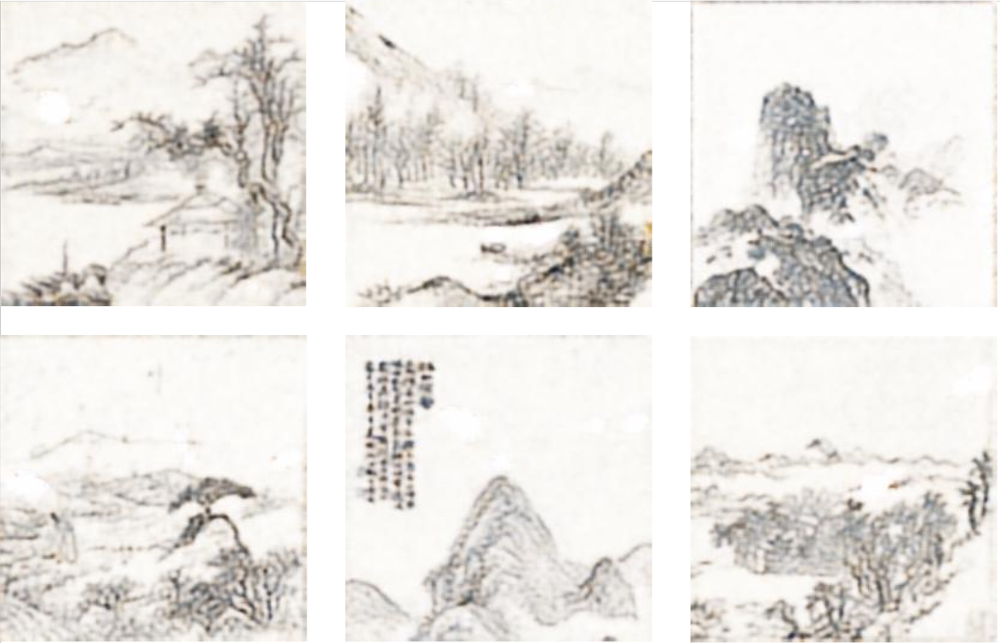

# Landscape-CycleGAN
Style transfer is a class of computer vision problem where the objective is to map target-style learned through training using a set of aligned image pairs from an input image to an output image. Our project explores the possibilities of utilizing Generative Adversarial Networks (GANs) to achieve Chinese landscape painting style transfer to images. We propose the methodology of generating Chinese landscape paintings using canny edge extraction algorithms to extract edges of input images and then use CycleGAN models to produce output images.

Sample output images generated by our proposed Sketch-And-Paint GAN models: 


# Table of Contents  
1. [Folder Organization](#folder)
2. [How to Run Code](#run)  
3. [About Dataset](#data) 
4. [Acknowledgement](#credit)

<a name="folder"/></a>
## Folder Organization
1. **Model** : contains all **.py** files for models, **.sh** files for downloading datasets,and running models
2. **Visualization** : contains all **.ipynb** for visualization

<a name="run"/></a>
## How to Run Code
1. Install the correct versions of the required Python libraries (or “packages”) to run the Python code we’ve written
<pre>
pip install -r requirements.txt
</pre>

2. Download ./Model folder, insider downloaded unzipped folder, download dataset by running
<pre>
sh get_data.sh
</pre>

3. Reproduce all the sketch or painting images by running following command:
<pre>
sh run_sketch.sh
</pre>
or 
```
python3 sketch.py \
  --subset='landscape' \
  --output_dir='../data/sketch/landscape'
```
4. Reproduce all the output images by running following command:
<pre>
un_paint.sh
</pre>
or 
```
python3 paint.py \
  --subset='Harvard' \
  --epoch=10
```

Note: change the sub-dataset name inside shell script to change the training dataset when running sketch and painting script.

<a name="data"/></a>
## About Dataset
The dataset we used for training and testing were from https://github.com/alicex2020/Chinese-Landscape-Painting-Dataset, which provided the dataset used to train GAN model. 
The dataset consists of 2,192 high-quality traditional Chinese landscape paintings (中国山水画). All paintings are sized 512x512, from the following sources:
* <a href=https://artmuseum.princeton.edu/search/collections>Princeton University Art Museum</a>, 362 paintings
* <a href=https://harvardartmuseums.org/collections/api>Harvard University Art Museum</a>, 101 paintings
* <a href=https://metmuseum.github.io/>Metropolitan Museum of Art</a>, 428 paintings
* <a href=http://edan.si.edu/openaccess/apidocs/>Smithsonian's Freer Gallery of Art</a>, 1,301 paintings

<a name="credit"/></a>
## Acknowledgement
* Pytorch implementation of CycleGAN referrencing public Github Repository: nachiket273,aitorzip. 
* Cited research works used for our project can be found on the referrence page inside the project's report.